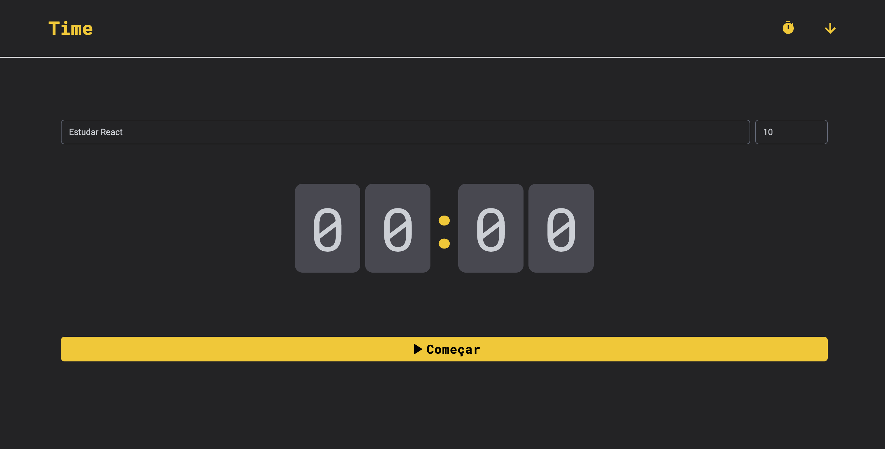
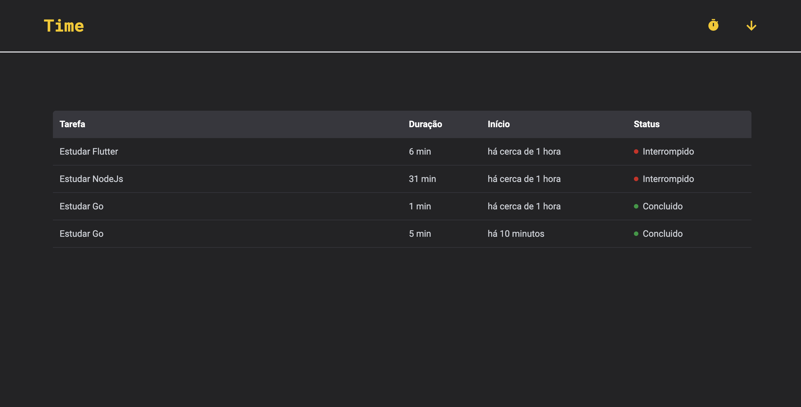

# Time

## Deploy

Este projeto está disponível online. Acesse a versão deployada [aqui](https://seu-deploy-na-vercel.com).

## Instalação

Para começar a usar este projeto, siga estas etapas:

1. Clone o repositório:

   ```bash
   git clone https://github.com/rodolphoreis/time.git
   cd time

   ```

2. **Inicie o servidor de desenvolvimento:**

   ```bash
   npm install

   ```

3. **Abra o navegador e navegue até** [http://localhost:3000](http://localhost:3000).

## Funcionalidades

- **Gerenciamento de Tarefas:** Crie e gerencie tarefas com duração especificada.
- **Registro de Tempo:** Registre o horário de início e término das tarefas.
- **Indicadores de Status:** Sinalização visual para a conclusão das tarefas (concluídas ou interrompidas).
- **Histórico de Tarefas:** Revise tarefas passadas e suas durações.
- **Design Responsivo:** Otimizado para uso em desktop e mobile.

## Imagens do Projeto

  
_Home_

  
_Histórico_

## Ferramentas Utilizadas

Este projeto foi desenvolvido utilizando as seguintes ferramentas e bibliotecas:

- React: Uma biblioteca JavaScript para construir interfaces de usuário.
- TypeScript: Uma linguagem que adiciona tipagem estática ao JavaScript, melhorando a manutenção e a escalabilidade do código.
- Vite: Uma ferramenta de build rápida para aplicações front-end.
- Tailwind CSS: Um framework CSS que permite a construção de interfaces responsivas de forma rápida e eficiente.
- Date-fns: Uma biblioteca para manipulação e formatação de datas.

## Contribuição

Contribuições são bem-vindas! Se você gostaria de contribuir para este projeto, por favor, faça um fork do repositório e envie um pull request com suas alterações.
